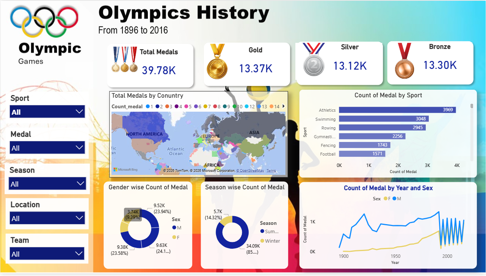

# 🏅 Olympics History Dashboard

## 1️⃣ Project Title / Headline

### Olympics History Dashboard using Power BI

An interactive Power BI dashboard designed to analyze Olympic Games data from 1896 to 2016, providing insights into medal distribution, country performance, sports trends, and athlete participation.

---

## 2️⃣ Short Description / Purpose

This project focuses on exploring historical Olympic data to uncover patterns in medal achievements, sports performance, gender participation, and country-wise success. The dashboard enables users to interactively analyze Olympic trends and gain meaningful insights through visual storytelling.

The main purpose of this project is to:

* Analyze global medal distribution
* Compare country-wise Olympic performance
* Track sports-wise medal achievements
* Monitor gender participation trends
* Support data-driven sports analytics

---

## 3️⃣ Tech Stack

### Tools & Technologies Used

* Power BI
* Excel
* DAX
* Data Modeling
* Data Visualization
* Business Intelligence

---

## 4️⃣ Data Source

### Dataset Used:

Olympics History Dataset (1896–2016)

The dataset contains:

* Athlete Information
* Country / Region
* Olympic Year
* Host City
* Sport & Event
* Medal Type
* Gender
* Season (Summer/Winter)

---

## 5️⃣ Features / Highlights

### Dashboard Features

✔️ KPI Cards for:

* Total Medals
* Gold Medals
* Silver Medals
* Bronze Medals

✔️ Country-wise Medal Distribution Map

✔️ Sport-wise Medal Analysis

✔️ Gender-wise Medal Distribution

✔️ Season-wise Medal Analysis

✔️ Medal Trends by Year

✔️ Interactive Filters for Sport, Medal, Season, Location, and Team

---

## 📈 Key Insights

* Nearly 40,000 medals were awarded between 1896 and 2016.
* Athletics contributed the highest number of medals among all sports.
* Male athletes won a larger share of medals historically.
* Female participation increased significantly over time.
* Summer Olympics accounted for the majority of medals awarded.
* Several countries consistently dominated the Olympic medal tally across multiple editions.

---

## 6️⃣ Screenshots 

### Dashboard Preview

---

# 🚀 Skills Demonstrated

* Data Analysis
* Dashboard Design
* KPI Reporting
* Data Modeling
* Business Intelligence
* Data Storytelling
* Power BI Visualization
* DAX Calculations

---

## 📌 Project Outcome

The dashboard provides a comprehensive view of Olympic history, helping users understand medal trends, athlete participation, and country performance through interactive visualizations.

---

---

⭐ If you found this project useful, please consider giving it a star!
